# Semantic Search: Architecture Diagrams

> **Статус:** diagrams describe the HNSW-first runtime after the semantic
> refactoring. Exact flat search is not a semantic runtime path. The low-level
> exact implementation remains only as a benchmark/reference oracle.

Этот файл иллюстрирует целевой lifecycle семантического индекса. Главная граница:

```text
HNSW topology navigates nearest-vector candidates.
Maps связывают известный документ с его векторами и разрешают найденные векторы обратно в chunks.
Arrays и bitsets дают быстрый доступ внутри конкретного сегмента.
VectorSource хранит prepared embeddings отдельно от HNSW topology.
```

## Виды Доступа

| Обозначение | Что делает | Пример |
| --- | --- | --- |
| `INDEX SEARCH` | Ищет ближайшие векторы, когда `DocID` неизвестен | `HNSW.Search(query)` по каждому visible segment |
| `MAP LOOKUP` | Находит значение по уже известному логическому ID | `currentByDoc[docID]`, `refByVector[vectorID]` |
| `ARRAY LOOKUP` | Обращается по плотному локальному ordinal | `segment.vectorIDs[vectorOrd]` |
| `BITSET LOOKUP` | Проверяет, актуален ли vector row | `liveBitset[vectorOrd]` |
| `BOUNDED TOP-K` | Ограничивает request-local ANN result/frontier memory | `efSearch` и `VisitLimit` |
| `ATOMIC PUBLISH` | Одновременно публикует согласованные mappings и liveness | замена всех chunks документа |

## Когда Задействован HNSW

`HNSW Search` и `HNSW Builder` — разные операции. Search читает уже готовый
граф, а Builder создаёт новый immutable граф для будущего сегмента.

| Операция | HNSW | Что происходит |
| --- | --- | --- |
| `AddDocument` | Используется для sealing batch | rows добавляются в ingest head и сразу публикуются как HNSW delta segment |
| `ReplaceDocument` | Используется для новой версии | старые locations находятся через maps; новая версия публикуется в HNSW delta segment |
| `DeleteDocument` | Не используется | через maps находятся ordinals и публикуется новый live bitset |
| `Search` | Используется | каждый visible HNSW segment выполняет `HNSW.Search`, затем hits merge-ятся |
| `Compaction` | Используется Builder | из live vectors выбранных segments строится новый HNSW segment |
| `Restart/Open` | Открывается Reader | graph загружается как immutable HNSW reader; поиск ещё не выполняется |

Самое важное:

```text
Replace/Delete не ищут документ через HNSW.
DocID уже известен, поэтому они используют currentByDoc и locationByVector.
HNSW задействуется только для semantic query или при построении нового segment.
```

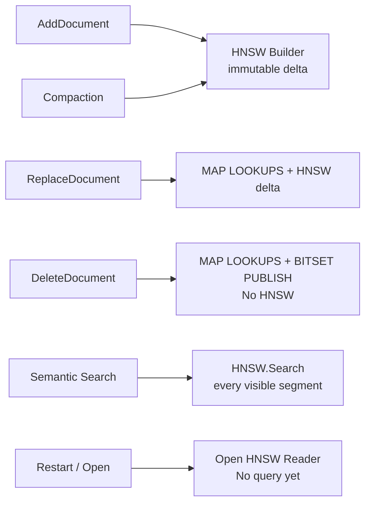

## Словарь Сущностей

| Сущность | Значение |
| --- | --- |
| `Document` | Внешний документ приложения. Сам текст не хранится в vector index. |
| `DocID` | Стабильный внешний ID документа, например `doc-A`. Используется для Replace/Delete и hybrid grouping. |
| `Chunk` | Фрагмент поля документа, передаваемый внешней embedding-модели. |
| `ChunkID` | ID фрагмента внутри текущей версии документа, например `chunk-2`. |
| `ChunkRef` | Ссылка на источник: `DocID`, `ChunkID`, поле и byte offsets. Позволяет приложению найти исходный текст. |
| `ChunkVector` | Пара `ChunkRef + []float32`, уже полученная от внешнего embedder. |
| `VectorID` | Внутренний стабильный ID конкретной версии chunk vector. Не является адресом внутри файла. |
| `VectorOrdinal` | Плотный локальный номер vector row внутри head или segment. Может измениться после commit/compaction. |
| `NodeOrdinal` | Плотный локальный номер узла HNSW. В первом формате связан с `VectorOrdinal` один-к-одному, но остаётся отдельным типом. |
| `ComponentID` | ID физического компонента поиска: mutable head, frozen head или sealed segment. |
| `Location` | Физический адрес `ComponentID + VectorOrdinal` для конкретного `VectorID`. |
| `currentByDoc` | Runtime map `DocID -> current []VectorID`. Нужна для Replace/Delete, а не для nearest-neighbor search. |
| `refByVector` | Runtime map `VectorID -> ChunkRef`. Разрешает найденный vector обратно в документ и chunk. |
| `locationByVector` | Runtime map `VectorID -> Location`. Позволяет Replace/Delete найти bit, который нужно сделать stale. |
| `segment.vectorIDs` | Плотный массив `VectorOrdinal -> VectorID` внутри сегмента. Это array lookup, не map. |
| `liveBitset` | Отдельный bitset для каждого head/segment по его локальному `VectorOrdinal`: `1` означает current/live, `0` означает stale/deleted. Он переиспользуется запросами и заменяется новым snapshot после Add/Replace/Delete. |
| `SemanticState` | Согласованный snapshot maps, locations, liveness, head и active segments. Search удерживает один snapshot до завершения. |
| `Mutable ingest head` | Небольшое in-memory prepared vector storage для новых rows. Не является search index. |
| `Frozen head` | Head, отделённый во время commit. Он остаётся searchable, пока из него строится segment. |
| `HNSW segment` | Immutable vectors + HNSW graph. Граф ускоряет поиск ближайших vector rows. |
| `HNSW heaps` | Request-local структуры обхода: accepted-result heap ограничен `efSearch`, а candidate frontier, visited и score cache ограничены `VisitLimit`. Это не общий межсегментный flat heap. |
| `Generation` | Согласованная persisted-версия: список segment objects плюс semantic mappings/liveness. |
| `CURRENT` | Маленький persisted-указатель на committed generation, которую нужно открыть после restart. |
| `Commit` | Замораживает head, строит segment и атомарно публикует новую generation. |
| `Compaction` | Перестраивает выбранные segments только из live vectors и удаляет stale данные после переключения generation. |

## Что Persisted, А Что Восстанавливается

| Данные | На диске | Runtime |
| --- | --- | --- |
| vectors и HNSW graph | segment files | immutable segment reader |
| `VectorOrdinal -> VectorID` | segment file | `segment.vectorIDs` |
| `DocID -> current []VectorID` | `semantic-state.bin` | `currentByDoc` |
| `VectorID -> ChunkRef` | `semantic-state.bin` | `refByVector` |
| liveness | generation state | per-component `liveBitset` snapshot |
| `VectorID -> Location` | не обязан дублироваться | восстанавливается при open из segment ordinal mappings |
| active segment list | generation manifest | immutable `SemanticState` snapshot |
| active generation ID | `CURRENT` | opened store state |

## Chunk-Centric Модель: Document 1:N Chunks

Semantic indexing использует модель **один document ко многим chunks**. Один
`Document` представлен одним или несколькими `ChunkRef`; каждый `ChunkRef`
принадлежит ровно одному `DocID`. Короткий document не является отдельным
случаем: он представлен одним chunk с `ChunkID = _whole`.

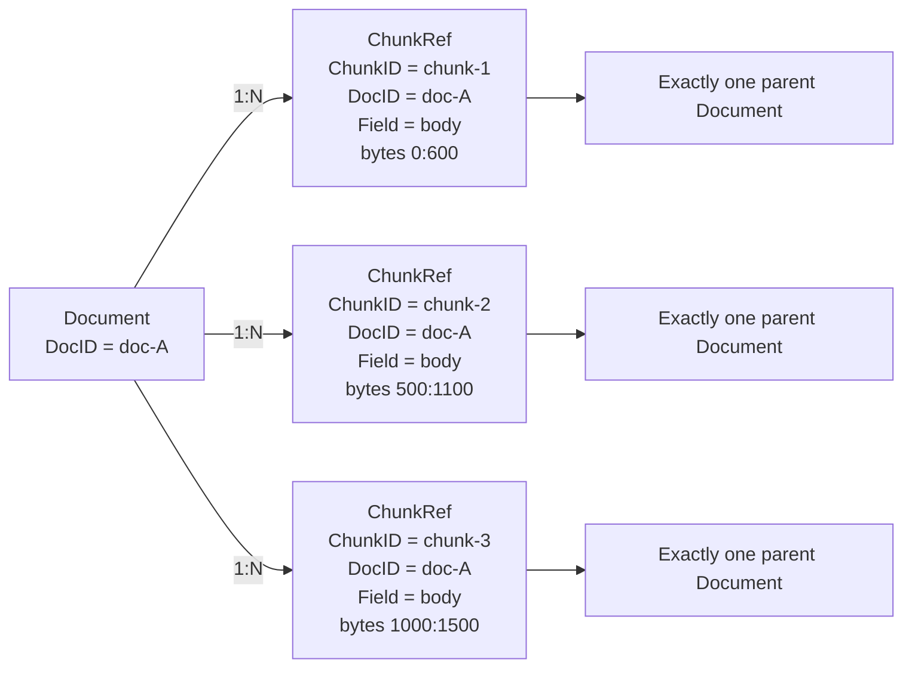

Cardinality и границы ответственности:

```text
Document 1 -> 1..N ChunkRef
ChunkRef N -> exactly 1 Document
ChunkRef 1 -> exactly 1 current ChunkVector
ChunkVector 1 -> exactly 1 VectorID and physical vector row

document batch   = единица Add/Replace/Delete и атомарной публикации
chunk vector     = единица semantic indexing и nearest-neighbor search
DocID            = единица document grouping и связи с application data
```

### Процесс Индексации Document

Core предоставляет paragraph-aware и overlapping-window splitters, но caller
может передать уже подготовленные chunks. Embedding всегда выполняет внешний
adapter: vector index не владеет моделью или tokenizer. `Chunk.Text` нужен только
до получения embedding и не сохраняется в vector index.

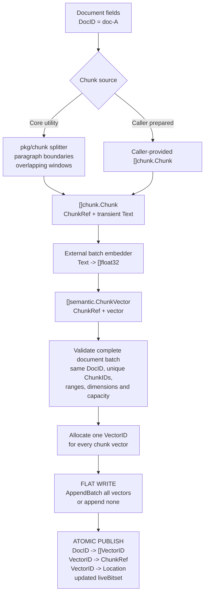

### Что Индексируется

Flat/HNSW индексирует не document и не `ChunkRef`, а плотные vector rows. В
первом формате одному chunk vector соответствует один `VectorID`, один
`VectorOrdinal` внутри физического component и, для HNSW segment, один
`NodeOrdinal`. `DocID`, byte ranges и application metadata не попадают в graph.

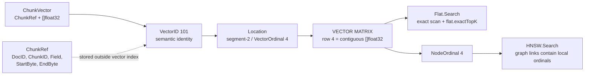

Vector algorithm boundary:

```text
flat/HNSW sees:     query vector, stored vectors, local ordinals, ResultFilter
flat/HNSW returns:  local ordinal + distance
flat/HNSW does not see: DocID, ChunkID, source text, fields, byte ranges
```

### Какие Связи Храним

`SemanticState` соединяет document lifecycle с физическими vector components.
Связи намеренно хранятся в разных направлениях: document mapping нужен для
Add/Replace/Delete, chunk reference — для разрешения search hit, locator — для
обновления liveness конкретного component.

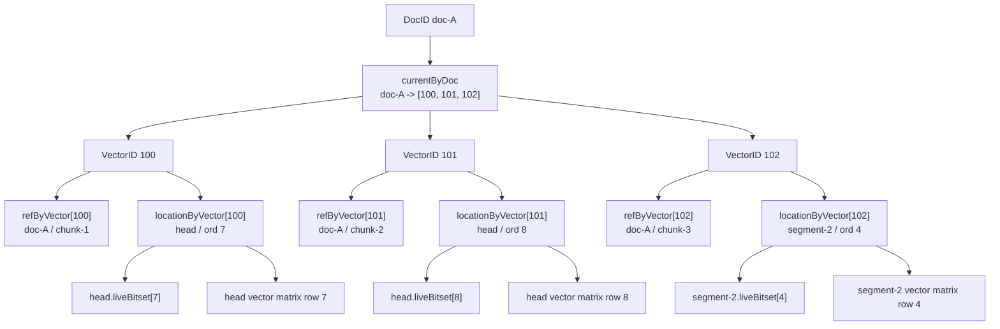

### От Search Hit Обратно К Document

Search сначала находит chunk vector. Затем semantic layer разрешает локальный
ordinal в `VectorID` и `ChunkRef`, группирует candidates по `ChunkRef.DocID` и
возвращает document hits. Найденные chunks входят в document hit как объяснение
результата. Исходный document или его fragment загружает caller из application
storage: vector index сам текст не хранит.

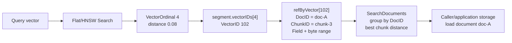

## Общая Модель

`DocID` ведёт к текущим chunk-vector версиям. Каждый `VectorID` одновременно
разрешается в логический `ChunkRef` и в физический `Location`.
Эта диаграмма показывает semantic mappings; HNSW здесь намеренно отсутствует.

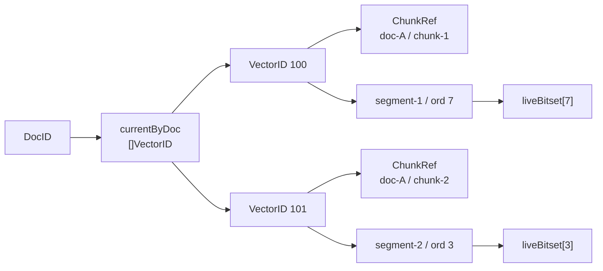

## AddDocument

Новый документ проходит chunking и embedding вне vector index. В semantic
service поступает уже готовый batch `[]ChunkVector`, который публикуется только
целиком. **HNSW здесь не вызывается и не изменяется**: запись идёт в mutable
flat head.

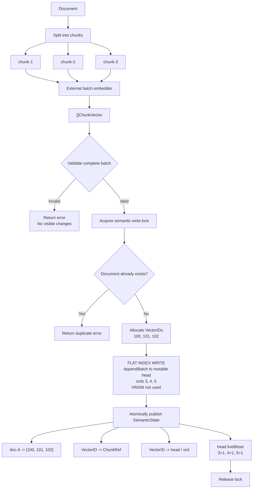

## ReplaceDocument

Старая версия остаётся live, пока все новые chunks не провалидированы и не
добавлены в head. Переключение mapping и bitsets происходит атомарно. **HNSW не
используется для поиска старых vectors и не перестраивается во время Replace**.

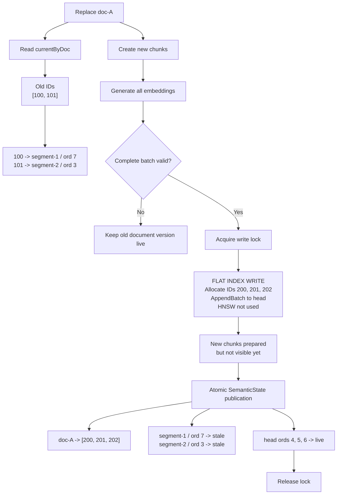

Эта state diagram подчёркивает, что ошибки подготовки возвращают систему в
полностью рабочую старую версию, а не оставляют частичное обновление.

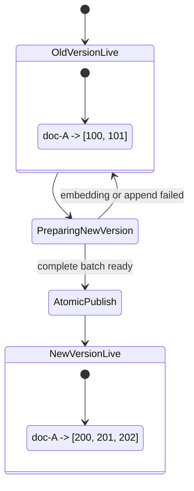

## DeleteDocument

Delete знает `DocID`, поэтому использует maps, а не HNSW. Физические vectors и
graph nodes остаются до compaction, но исключаются из результатов через новый
live-bitset snapshot.

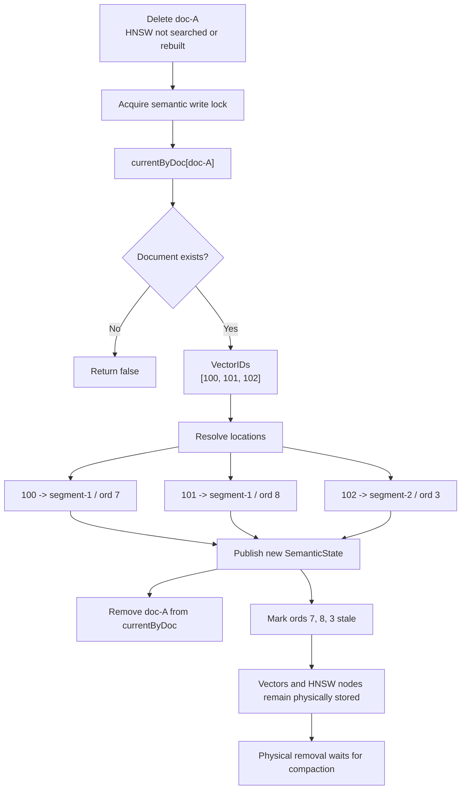

## HNSW Search Внутри Сегмента

Здесь начинается именно `INDEX SEARCH`. HNSW не знает `DocID`: он сравнивает
query vector с vector rows и перемещается по graph links. Stale node можно
использовать как маршрут, но нельзя положить в result heap. Candidate/result
heaps здесь принадлежат алгоритму HNSW: accepted-result heap ограничен
`efSearch`, а candidate frontier и score cache — `VisitLimit`. Это не
`flat.exactTopK` exact flat scan. Search orchestration находится в
`pkg/vector/hnsw/search.go`: `search` вызывает `greedySearch` для upper levels и
`levelSearch` для level 0.

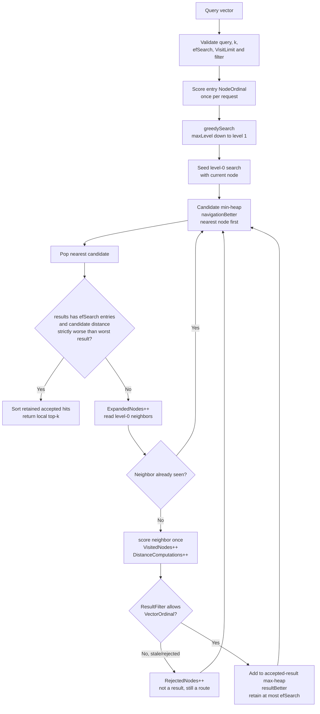

### `NodeOrdinal` Не Является Номером Level

`NodeOrdinal 2` означает graph node с локальным ID `2`, а не `level 2`.
`maxLevel = 1` означает, что search использует upper `level 1` и base `level 0`.
Один node может присутствовать на нескольких levels; его vector и distance при
этом остаются теми же. Production `Reader` хранит один `levels[node]`, а наличие
node на конкретном level определяется условием `level <= levels[node]`. Tests с
готовыми adjacency lists сначала пропускают их через тот же production packing и
validation, что использует `Builder.Freeze`.

Важно различать membership и outgoing adjacency:

```text
node существует
    если для него есть vector row и NodeOrdinal

links[node][level]
    хранит только исходящие links этого node на указанном level

отсутствующий key level или пустой map
    означает "нет исходящих links", а не "node отсутствует на level"
```

Поэтому fixture:

```go
[]map[int][]NodeOrdinal{
    {1: {1}},
    {1: {2}},
    {},
}
```

читается так:

```text
NodeOrdinal 0 существует на levels 1 и 0
    level 1 outgoing links: [NodeOrdinal 1]
    level 0 outgoing links: []

NodeOrdinal 1 существует на levels 1 и 0
    level 1 outgoing links: [NodeOrdinal 2]
    level 0 outgoing links: []

NodeOrdinal 2 существует на levels 1 и 0
    level 1 outgoing links: []
    level 0 outgoing links: []
```

`NodeOrdinal 2` присутствует на `level 1`, потому что valid adjacency содержит
на него link с этого level. То, что его собственный map `{}` пуст, означает
только отсутствие исходящих links. Directed HNSW links не обязаны иметь reverse
link.

Следующая схема соответствует fixture из
`TestSearchGreedyUpperLevelStopsAtLocalMinimum`:

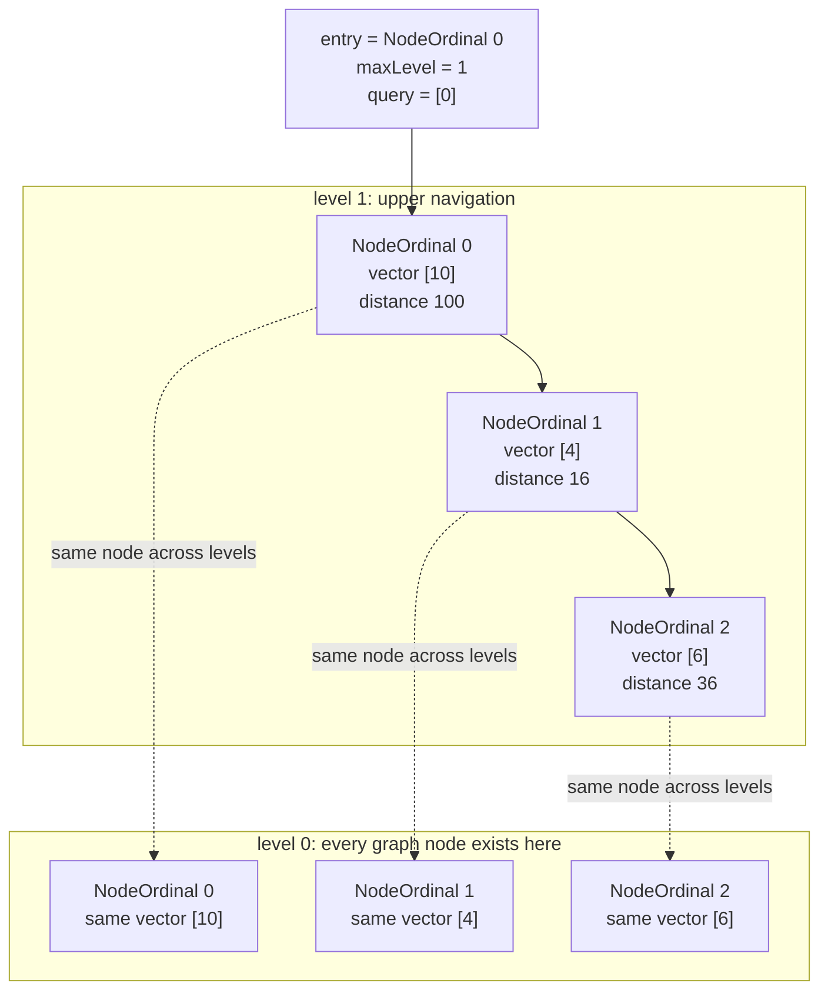

Здесь `NodeOrdinal 2` сравнивается с query на `level 1`, потому что adjacency
`Neighbors(NodeOrdinal(1), 1)` содержит `NodeOrdinal(2)`. Значение `2` является
ID node и никак не повышает текущий level.

`NodeOrdinal 0` также точно присутствует на `level 1`: fixture объявляет его
entry point при `maxLevel = 1`, а `links[0][1]` содержит его исходящий link к
`NodeOrdinal 1`. Distance `100` вычисляется из единственного vector row node 0:
`([10] - [0])^2`. Level выбирает adjacency list, но не создаёт отдельную копию
vector и не меняет distance.

### Пошаговый Upper-Level Greedy

`greedySearch` хранит только один `current` node. Он читает neighbors текущего
level и переходит только к node со **строго меньшей** distance. Equal-distance
neighbor не вызывает переход. Когда улучшений больше нет, тот же current node
передаётся на следующий level.

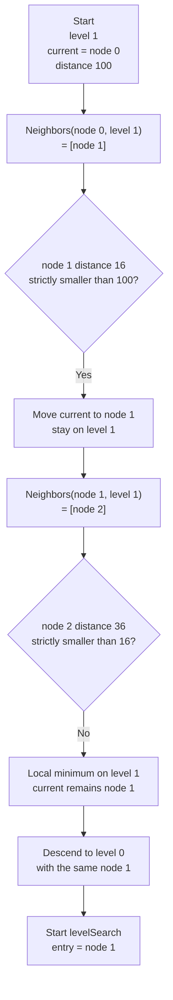

Distance сравнивается между nodes одного adjacency level. Level определяет,
какие links разрешено читать; distance всегда вычисляется между query и vector
конкретного node.

### Почему На Level 0 Нужен Beam

Upper greedy не идёт через временно худший node. Level-0 `levelSearch` хранит
несколько alternatives в candidate frontier; ширину определяет `efSearch`.
Fixture из `TestSearchLevelZeroBeamEscapesLocalMinimumOverDirectedLinks`:

```text
query = [0]

node 0 vector [2] distance 4
    -> node 1 vector [3] distance 9
        -> node 2 vector [1] distance 1
```

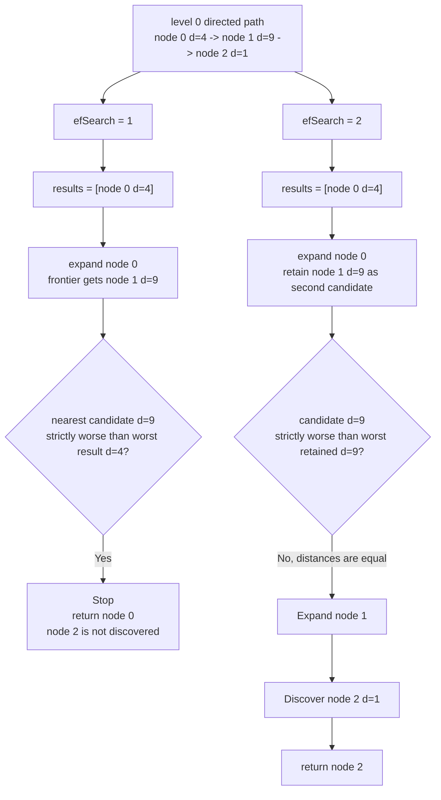

Beam termination использует только strict distance comparison:
`candidate.distance > worst.distance`. Equal-distance candidate раскрывается,
потому что он может вести к более близкому node. Итоговый tie-break по ordinal
применяется к result ordering, но не должен обрезать navigation route.

### Filtering Не Удаляет Navigation Routes

`ResultFilter` решает только, можно ли добавить `VectorOrdinal` в accepted-result
heap. Любой впервые обнаруженный node, включая stale/rejected, получает distance
и попадает в candidate frontier. Fixture из
`TestSearchUsesRejectedNodesAsRoutesButNeverReturnsThem`:

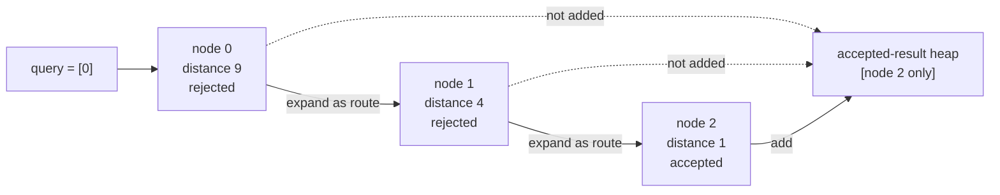

Если удалить node 0 или node 1 из navigation frontier из-за filter, accepted
node 2 станет недостижим. Поэтому `score` сохраняет отдельно `accepted`,
`levelSearch` всегда вызывает `frontier.Push(discovered)` и только условно —
`results.Add(discovered)`.

## HNSW Builder И Packed Reader

`Builder` и `Reader` разделяют write path и read path. `Builder.Add` изменяет
mutable adjacency lists и рассчитан на одного writer. `Freeze` проверяет, что
добавлены все ожидаемые `VectorOrdinal`, повторно валидирует topology и создаёт
независимый immutable `Reader`, безопасный для concurrent search. Сам Builder
при этом не уничтожается и не передаёт Reader свои mutable slices.

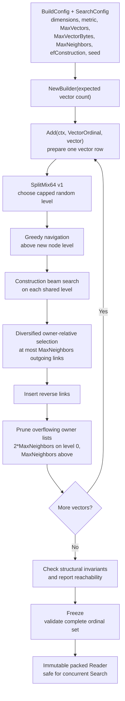

Entry point меняется только если новый node получил level строго выше текущего
maximum. Links после reverse-list pruning не обязаны быть симметричными.
`Check` считает directed reachability от entry на level 0, но unreachable node
не делает структурно корректный graph невалидным: это quality signal для Phase 6,
а не повод неявно достраивать связи в первой версии Builder.

Packed Reader не дублирует vector для каждого level:

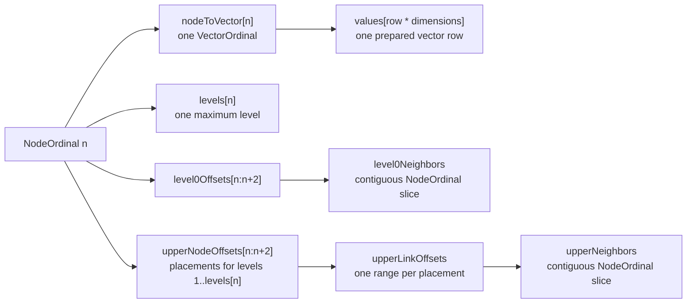

`Neighbors(node, level)` выбирает нужный contiguous range за O(1). Public метод
возвращает copy, а hot search path читает внутренний immutable view без
дополнительной allocation.

## Flat Exact Search Внутри Компонента

Mutable head и exact reference oracle сканируют vector rows
последовательно. У каждого вызова `Flat.Search` собственный `flat.exactTopK`;
segments не пишут параллельно в один heap. `liveBitset` принадлежит конкретному
компоненту и проверяется до distance calculation, поэтому stale rows не занимают
место в top-k и не создают лишних вычислений distance.

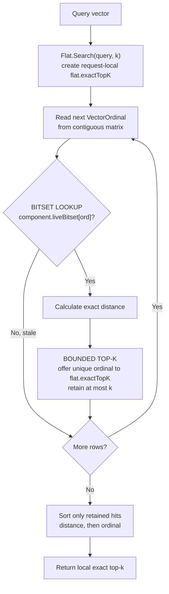

## Разрешение HNSW Hit В Документ

После index search начинается resolution: локальные ordinals преобразуются
через arrays и maps в `ChunkRef`. Только на этом этапе появляется `DocID`.

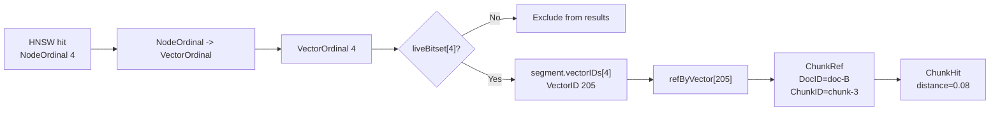

## Поиск По Нескольким Сегментам

Каждый component выполняет локальный vector search независимо. Локальные hits
разрешаются в chunks, объединяются по distance и затем группируются по `DocID`.
Именно здесь готовые HNSW segments используются для query-time search.
Flat components используют собственный `flat.exactTopK`, HNSW components — свои
traversal heaps. После этого global merge работает только с небольшими уже
ограниченными списками: их можно сложить, отсортировать и обрезать до нужного
candidate budget без общего heap, заполняемого segments параллельно.

```mermaid
flowchart TD
    Q["Query vector"] --> SNAPSHOT["Acquire SemanticState snapshot"]

    SNAPSHOT --> S1["HNSW SEARCH<br/>segment-1<br/>local HNSW heaps"]
    SNAPSHOT --> S2["HNSW SEARCH<br/>segment-2<br/>local HNSW heaps"]
    SNAPSHOT --> S3["FLAT EXACT SEARCH<br/>segment-3<br/>local flat.exactTopK"]
    SNAPSHOT --> HEAD["FLAT EXACT SEARCH<br/>mutable head<br/>local flat.exactTopK"]

    S1 --> R1["Local chunk hits"]
    S2 --> R2["Local chunk hits"]
    S3 --> R3["Local chunk hits"]
    HEAD --> R4["Local chunk hits"]

    R1 --> MERGE["Global distance merge<br/>append + sort + truncate"]
    R2 --> MERGE
    R3 --> MERGE
    R4 --> MERGE

    MERGE --> RESOLVE["VectorID -> ChunkRef"]

    RESOLVE --> CHUNKS["Global chunk ranking"]

    CHUNKS --> GROUP["Group by DocID"]

    GROUP --> DOCS["Document ranking<br/>distance = best chunk distance"]

    DOCS --> RELEASE["Release SemanticState snapshot"]
```

## Группировка Чанков По Документам

Grouping использует query-local map `DocID -> document accumulator`. Начальное
правило ranking: distance документа равна минимальной distance его chunks.

```mermaid
flowchart TD
    HITS["Chunk hits"] --> H1["doc-A / chunk-3<br/>distance 0.05"]
    HITS --> H2["doc-A / chunk-1<br/>distance 0.08"]
    HITS --> H3["doc-B / chunk-2<br/>distance 0.11"]
    HITS --> H4["doc-C / chunk-1<br/>distance 0.14"]

    H1 --> GA["Group doc-A"]
    H2 --> GA
    H3 --> GB["Group doc-B"]
    H4 --> GC["Group doc-C"]

    GA --> DA["doc-A<br/>best distance 0.05<br/>chunks 3 and 1"]
    GB --> DB["doc-B<br/>best distance 0.11"]
    GC --> DC["doc-C<br/>best distance 0.14"]

    DA --> FINAL["Final document top-k"]
    DB --> FINAL
    DC --> FINAL
```

## Commit

Commit не перестраивает все старые segments. Он замораживает только текущий
head, строит из него новый immutable segment и публикует generation, содержащую
полный список старых и нового segments. Здесь может использоваться **HNSW
Builder**, но не `HNSW.Search`.

```mermaid
flowchart TD
    BEFORE["Before commit"] --> OLDSEG["Existing segments"]
    BEFORE --> HEAD["Mutable head<br/>new chunk vectors"]

    HEAD --> ROTATE["Rotate head under write lock"]

    ROTATE --> FROZEN["Frozen pending head"]
    ROTATE --> NEWHEAD["New mutable head"]

    NEWHEAD --> WRITES["New writes continue"]

    FROZEN --> SIZE{"Large enough for HNSW?"}

    SIZE -- "No" --> FLAT["FLAT BUILDER<br/>Build sealed flat segment"]
    SIZE -- "Yes" --> HNSW["HNSW BUILDER<br/>Build new graph from frozen head"]

    FLAT --> FILES["Write immutable segment files"]
    HNSW --> FILES

    OLDSEG --> GEN["Build new generation manifest"]
    FILES --> GEN

    GEN --> STATE["Write mappings, ChunkRefs,<br/>liveness and max allocated VectorID"]

    STATE --> CURRENT["Atomically switch CURRENT"]

    CURRENT --> INSTALL["Install new runtime state"]

    INSTALL --> COMMITTED["Commit complete"]
```

## Поиск Во Время Commit

Frozen head остаётся searchable, новый head принимает записи, а existing
segments продолжают обслуживать запросы. Финальный state swap происходит только
после готовности нового segment. Frozen/new heads ищутся через flat scan,
existing HNSW segments — через `HNSW.Search`, а новый graph параллельно создаёт
`HNSW Builder`.

```mermaid
sequenceDiagram
    participant W as Writer
    participant S as SemanticStore
    participant F as FrozenHead
    participant N as NewHead
    participant Q as Search
    participant D as Disk

    W->>S: Commit()
    S->>F: Rotate old head
    S->>N: Install empty mutable head

    par HNSW Builder
        F->>D: Build and write new HNSW segment
    and New writes
        W->>N: Add new chunk vectors
    and Search
        Q->>F: Flat search frozen head
        Q->>N: Flat search new head
        Q->>S: HNSW/flat search existing segments
    end

    D->>S: Segment ready
    S->>D: Publish new generation
    S->>S: Swap runtime state
```

## Compaction

Compaction выбирает несколько старых segments, читает только live vector rows и
строит replacement segment. Старые файлы удаляются лишь после завершения
запросов, удерживающих предыдущий `SemanticState` snapshot. Если replacement
достаточно большой, здесь используется **HNSW Builder**, а не query-time search.

```mermaid
flowchart TD
    START["Active generation"] --> S1["segment-1<br/>live + stale"]
    START --> S2["segment-2<br/>live + stale"]
    START --> S3["segment-3<br/>live"]

    S1 --> READ["Read only live chunk vectors"]
    S2 --> READ
    S3 --> READ

    READ --> REBUILD["FLAT OR HNSW BUILDER<br/>Reassign local ordinals<br/>Build replacement index"]

    REBUILD --> S4["segment-4<br/>only live vectors"]

    S4 --> GEN["Publish new generation"]

    GEN --> SWITCH["CURRENT -> new generation"]

    SWITCH --> WAIT["Wait for old readers"]

    WAIT --> DELETE["Delete unreferenced old segments"]
```

## Перезапуск После Commit

`CURRENT` определяет единственную committed generation. Runtime locator map
восстанавливается из плотных `VectorOrdinal -> VectorID` mappings всех открытых
segments. HNSW graph здесь только открывается как Reader; `HNSW.Search` начнётся
после поступления query.

```mermaid
flowchart TD
    START["Process starts"] --> READ["Read CURRENT"]

    READ --> GEN["Open referenced generation"]

    GEN --> MANIFEST["Read manifest"]

    MANIFEST --> SEGMENTS["Open active flat/HNSW readers<br/>No search yet"]
    MANIFEST --> STATE["Load semantic-state.bin"]

    SEGMENTS --> ORDMAP["Rebuild VectorID -> segment/ordinal locations"]
    STATE --> MAPS["Restore currentByDoc,<br/>ChunkRefs and liveness"]

    ORDMAP --> READY["Semantic store ready"]
    MAPS --> READY
```

## Сбой Во Время Commit

Атомарная замена `CURRENT` является commit point. До неё открывается старая
generation, после неё — новая; graph и semantic mappings разных generations не
смешиваются.

```mermaid
flowchart TD
    G1["CURRENT -> generation 1"] --> BUILD["Build generation 2"]

    BUILD --> CRASH{"When did process fail?"}

    CRASH -- "Before CURRENT switch" --> OLD["Restart with generation 1"]

    CRASH -- "After CURRENT switch" --> NEW["Restart with generation 2"]

    OLD --> SAFE1["Old generation remains complete"]
    NEW --> SAFE2["New generation is complete"]

    BUILD --> INVALID["Never expose:<br/>new graph + old mappings"]
```

## Полная Шпаргалка

```mermaid
flowchart LR
    ADD["Add / Replace"] --> FLATWRITE["FLAT WRITE<br/>AppendBatch to head"]
    DELETE["Delete"] --> STATEWRITE["MAP + BITSET PUBLISH<br/>No HNSW"]

    FLATWRITE --> HEAD["Mutable flat head + SemanticState"]
    STATEWRITE --> HEAD

    QUERY["Query vector"] --> HSEARCH["HNSW.Search<br/>sealed HNSW segments"]
    QUERY --> FSEARCH["Flat.Search<br/>head + flat segments"]

    HSEARCH --> MERGE["Merge chunk hits"]
    FSEARCH --> MERGE

    HEAD --> COMMIT["Commit"]
    COMMIT --> BUILDER["Flat/HNSW Builder"]
    BUILDER --> SEGMENT["New immutable segment"]
    SEGMENT --> GENERATION["New generation"]

    GENERATION --> CURRENT["CURRENT"]
    CURRENT --> RESTART["Recover after restart"]

    GENERATION --> COMPACTION["Compaction"]
    COMPACTION --> REBUILD["Flat/HNSW Builder"]
    REBUILD --> CLEAN["Replacement segment<br/>live vectors only"]
```
