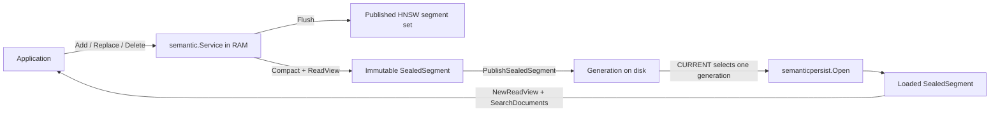
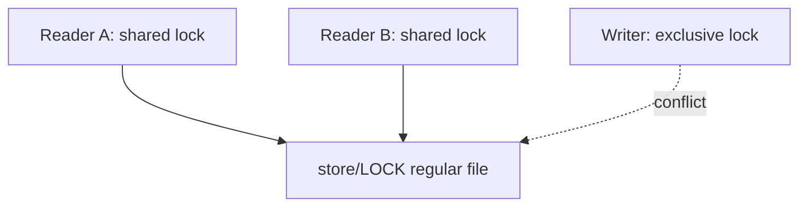
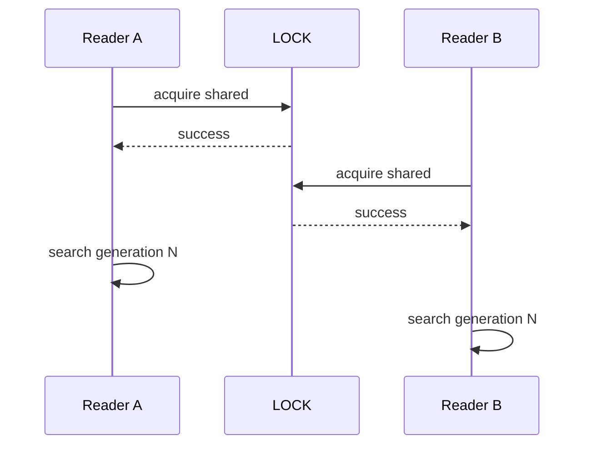
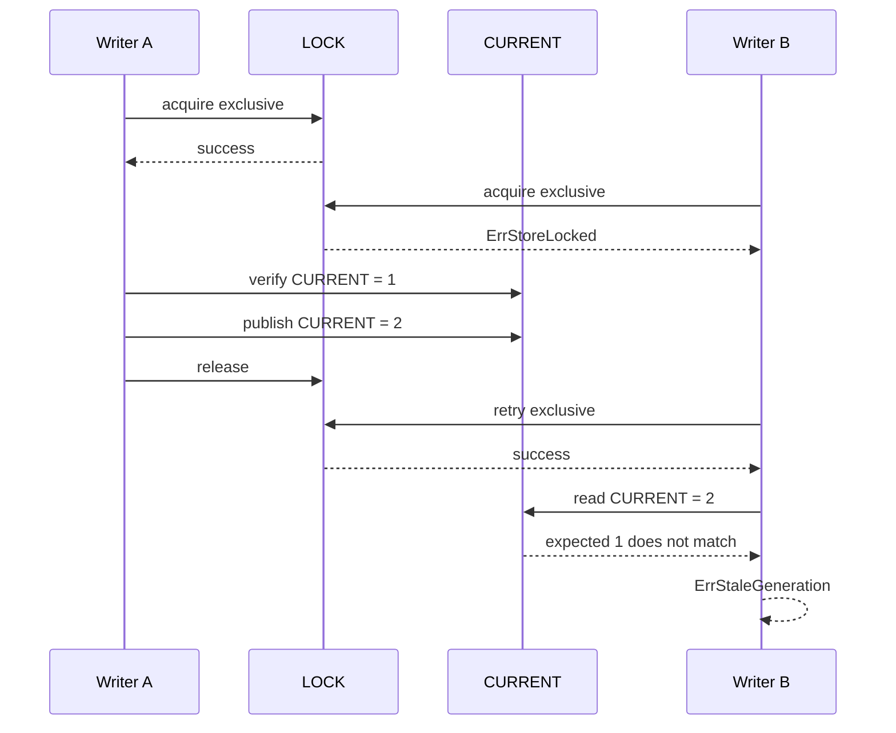
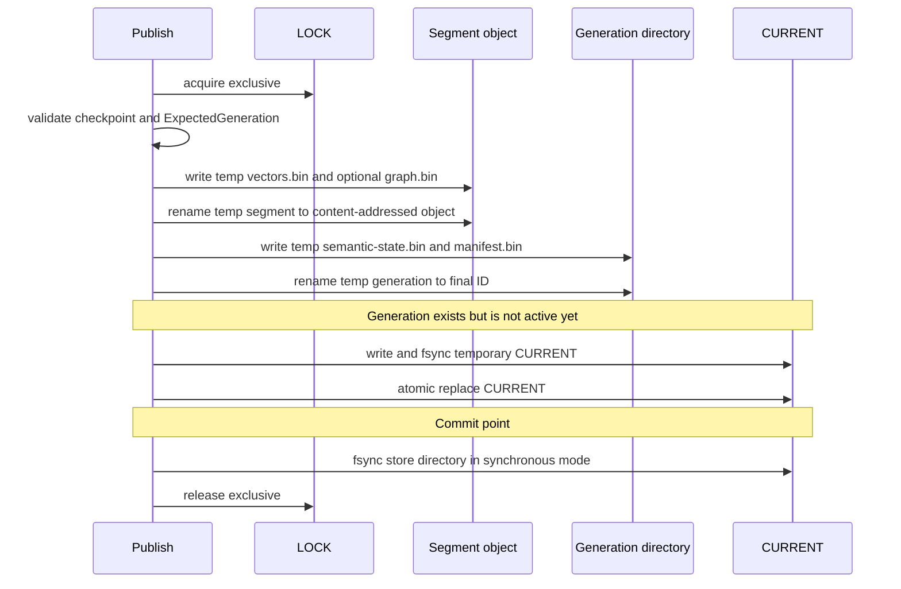
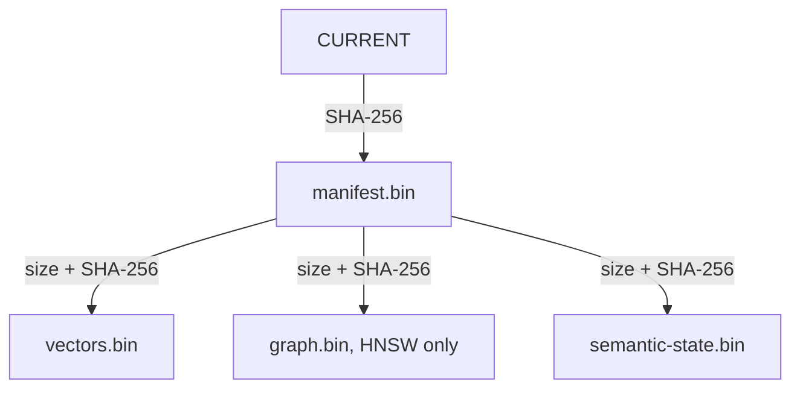
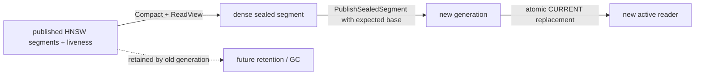

# Semantic Persistence: Locks, Generations And Recovery

Этот документ объясняет текущую реализацию `pkg/semanticpersist` через схемы и
конкретные кейсы. Runnable example:

```bash
go run ./examples/client-library/semantic-persistence
```

## Phase 0 Contract

Текущая persistence implementation сохранена как transitional compatibility
layer. Целевая semantic search архитектура будет HNSW-first:

- flat exact search не является semantic runtime strategy;
- exact fallback не используется новым semantic code;
- old snapshot-driven и flat-generation artifacts не являются semantic runtime API и
  требуют explicit migration старых fixtures/generations;
- visibility policy использует explicit buffered `Flush` и immutable HNSW delta
  segments; до `Flush` pending mutations не видны в published search view;
- обычный in-memory semantic search не требует disk store;
- старые flat generations требуют explicit graph rebuild и не открываются
  автоматически как ANN generations.

Для одного immutable artifact доступны `semanticpersist.SaveSealedSegment` и
`semanticpersist.OpenSealedSegment`. Они не создают `CURRENT`, не требуют
mutable service и не удерживают store lock. `PublishSealedSegment`/`Open`
используются только когда нужна generation publication, locking и recovery.
`SaveSegment`/`OpenSegment` являются короткими aliases sealed-segment API.

Ниже описан lifecycle persistence для sealed segments и generations.

## Четыре Разные Гарантии

Persistence использует несколько механизмов, которые решают разные задачи.

| Механизм | Что гарантирует | Чего не гарантирует |
|---|---|---|
| `LOCK` + OS file lock | Readers и writers не изменяют store одновременно | Сохранение данных после power loss |
| Temporary files + atomic rename | Reader видит старую или новую версию файла, но не половину новой | Что новая версия уже записана на физический носитель |
| CRC-32 и SHA-256 | Corruption и подмена связанного файла обнаруживаются | Автоматическое восстановление повреждённого файла |
| `fsync` файлов и директорий | Подтверждённые данные должны пережить power loss | Защиту от логически неверного checkpoint |

Главное правило:

```text
lock != atomic commit != checksum != durability
```

Все четыре механизма нужны одновременно, потому что каждый закрывает отдельный
класс ошибок.

## Основной Lifecycle



`semantic.Service` остаётся mutable и работает в памяти. Persistence не
сохраняет каждую mutation автоматически. Caller явно делает:

```go
if err := service.Compact(ctx); err != nil {
    return err
}
view, err := service.ReadView(ctx)
if err != nil {
    return err
}
sealed := semanticpersist.SealedSegment{
    Segment: view.Segments()[0], Space: service.Space(), Chunking: service.Chunking(),
    MaxAllocatedVectorID: service.Statistics().MaxAllocatedVectorID,
    MaxK: 10, MaxChunkCandidates: 100, MaxChunksPerDocumentHit: 3,
}

generation, err := semanticpersist.PublishSealedSegment(
    ctx,
    root,
    1,
    sealed,
    semanticpersist.Options{ExpectedGeneration: 0},
)
```

Только после успешного `Publish` checkpoint становится опубликованной
generation.

## Layout Store

```text
store/
├── LOCK
├── CURRENT
├── objects/
│   └── segments/
│       └── seg-<content-hash>/
│           ├── vectors.bin
│           └── graph.bin       # only for HNSW segments
└── generations/
    ├── 00000000000000000001/
    │   ├── semantic-state.bin
    │   └── manifest.bin
    └── 00000000000000000002/
        ├── semantic-state.bin
        └── manifest.bin
```

Назначение файлов:

| Файл | Содержимое |
|---|---|
| `LOCK` | Стабильный обычный файл, на который kernel устанавливает shared/exclusive lock |
| `CURRENT` | ID активной generation и hash её manifest |
| `vectors.bin` | Physical flat vector matrix |
| `graph.bin` | Optional packed HNSW topology bound to the exact `vectors.bin` size and SHA-256 |
| `semantic-state.bin` | Ordered `VectorRow` records, descriptors, search limits и maximum allocated `VectorID` |
| `manifest.bin` | Hashes и sizes всех файлов generation |

## Что Такое Generation

Generation является полным immutable semantic snapshot.

Пример до replace:

```text
generation 1

doc-A -> VectorIDs [9, 10]
doc-B -> VectorIDs [11]

Rows[0..2] describe the same vector ordinals
```

После replace `doc-A` mutable service содержит:

```text
physical rows:
ordinal 0 -> VectorID 9, stale
ordinal 1 -> VectorID 10, stale
ordinal 2 -> VectorID 11, live
ordinal 3 -> VectorID 12, live

current documents:
doc-A -> [12]
doc-B -> [11]
```

Новый sealed segment можно опубликовать как generation 2. Generation 1 при этом
не переписывается. `Service.Compact` не переносит stale rows:

```text
generation 2

row 0 -> VectorID 11 -> doc-B
row 1 -> VectorID 12 -> doc-A
```

## Что Такое `CURRENT`

Наличие generation directory не делает generation активной. Активна только та,
на которую указывает `CURRENT`.

```text
generations/1 exists
generations/2 exists
CURRENT -> 1

Open returns generation 1
```

Замена `CURRENT` является commit point:

```text
до atomic rename:    readers открывают generation 1
после atomic rename: readers открывают generation 2
```

Normal `Open` никогда не сканирует directories в поисках самой новой generation.
Это предотвращает автоматическое открытие orphan, который writer не успел
commit-нуть.

## Что Такое `LOCK`

`LOCK` является обычным файлом, а состояние lock хранится в kernel.

```text
наличие store/LOCK не означает, что store сейчас занят
```

Файл остаётся после освобождения lock и не должен удаляться вручную.



Текущая политика:

| Операция | Lock | Lifetime |
|---|---|---|
| `Open` | Shared | До `Loaded.Close()` |
| `Publish` | Exclusive | До завершения публикации |
| `RepairCurrent` | Exclusive | До завершения repair |

Несколько readers могут работать одновременно. Writer требует, чтобы активных
readers и другого writer не было.

Lock non-blocking: вместо ожидания package возвращает `ErrStoreLocked`.

## Кейс: Два Reader



Оба reader могут искать параллельно.

## Кейс: Reader Блокирует Publish

```go
loaded, err := semanticpersist.Open(root, limits)
if err != nil {
    return err
}

_, err = semanticpersist.Publish(ctx, root, 2, checkpoint, options)
// err is semanticpersist.ErrStoreLocked

if err := loaded.Close(); err != nil {
    return err
}

_, err = semanticpersist.Publish(ctx, root, 2, checkpoint, options)
// writer can acquire the exclusive lock now
```

Схема:

```text
Open
  -> shared lock acquired
  -> Loaded returned

Publish
  -> exclusive lock requested
  -> ErrStoreLocked

Loaded.Close
  -> shared lock released

Publish retry
  -> exclusive lock acquired
```

## Кейс: Два Writer

Оба writer считают, что активна generation 1:

```text
Writer A: ExpectedGeneration = 1, publishes 2
Writer B: ExpectedGeneration = 1, publishes 3
```

Сценарий:



Lock не заменяет `ExpectedGeneration`. Lock сериализует writers, а
`ExpectedGeneration` обнаруживает, что второй writer работал на устаревшей базе.

## Успешный Publish



Пока `CURRENT` не заменён, новый segment/generation может существовать на диске,
но readers продолжат открывать previous generation.

## Кейс: Crash До Commit

Состояние перед crash:

```text
generation 1 exists
generation 2 exists
CURRENT -> 1
```

После restart:

```go
loaded, err := semanticpersist.Open(root, limits)
// loaded.Generation.ID == 1
```

Generation 2 является orphan. Она игнорируется normal `Open` и может быть
выбрана только explicit repair или удалена будущим garbage collector.

## Кейс: Ошибка После Commit

Сценарий:

```text
atomic replacement CURRENT succeeded
final directory fsync failed
```

Runtime уже может видеть новую generation, но неизвестно, переживёт ли замена
power loss. Возвращается:

```text
ErrIndeterminate
```

Caller не должен слепо считать операцию failed и повторять её с прежним
`ExpectedGeneration`. Нужно заново прочитать store:

```go
loaded, err := semanticpersist.Open(root, limits)
```

и проверить фактический `loaded.Generation.ID`.

## Кейс: Missing Или Corrupt `CURRENT`

Normal `Open` fail-closed:

```text
CURRENT missing -> ErrCurrentMissing
CURRENT corrupt -> ErrCorrupt
```

Даже если `generations/2` полностью валидна, package не выбирает её
автоматически.

Явное восстановление:

```go
err := semanticpersist.RepairCurrent(
    root,
    2,
    semanticpersist.Options{
        Durability: semanticpersist.DurabilitySynchronous,
    },
)
```

`RepairCurrent` полностью проверяет generation 2, hashes, mappings, vectors и
limits. Только после этого он атомарно публикует новый `CURRENT`.

## Synchronous И Asynchronous Durability

### Synchronous

```go
Durability: semanticpersist.DurabilitySynchronous
```

Writer выполняет `fsync` для файлов и затронутых директорий. Успешный return
подтверждает ожидаемую power-loss durability, кроме явно indeterminate outcome.

### Asynchronous

```go
Durability: semanticpersist.DurabilityAsynchronous
```

Temporary files и atomic rename всё ещё защищают readers от частично видимой
generation, но `fsync` пропускается.

```text
atomic visibility: yes
power-loss durability: no guarantee
```

## Hash Chain И Corruption



Каждый codec также содержит magic, version и CRC-32. Проверки обнаруживают:

- truncated file;
- trailing bytes;
- изменённый payload;
- подмену одного valid file другим;
- несовпадающие mappings и vector counts;
- превышение allocation limits.

Checksums обнаруживают corruption, но не исправляют его. Recovery остаётся
явной операцией.

## Компактизация Stale Vectors

`ReplaceDocument` и `DeleteDocument` сразу исключают старые ordinals из search
results через immutable live bitset внутри mutable service, но физические vector
rows остаются в старых immutable segments до compaction. `ReadView` сохраняет
component set и liveness filters, а persisted sealed segment может быть dense.

`Compact` нужен только для раннего освобождения capacity mutable head:

```go
before := service.Statistics()
if err := service.Compact(ctx); err != nil {
    return err
}
after := service.Statistics()

// after.PhysicalVectors == after.LiveVectors
view, err := service.ReadView(ctx)
```

`Service.Compact` строит новый immutable HNSW segment только из live rows вне
service lock, затем атомарно заменяет published component set и locator maps.
Stable `VectorID`, document mappings и `MaxAllocatedVectorID` не изменяются.
Ошибка или cancellation оставляет старое состояние целиком.

`Service.ReadView(ctx)` возвращает текущий immutable component set без копирования
vectors. Для standalone persistence caller выбирает sealed component из view;
`ExpectedGeneration` по-прежнему защищает от stale writer.



Компактизация удаляет stale rows из новой generation, но сама не удаляет старые
generation directories и content-addressed segment objects. Это безопасно для
старых readers, но освобождение диска требует отдельного retention/GC flow.

## Полный Пользовательский Кейс

```go
encoder, err := semanticencode.New(chunker, embeddingProvider)
if err != nil {
    return err
}

// 1. Mutable changes in RAM.
service.AddDocument(ctx, encoder, semantic.Document{ID: "doc-a", Fields: fieldsA})
service.AddDocument(ctx, encoder, semantic.Document{ID: "doc-b", Fields: fieldsB})

// 2. Build one dense immutable segment.
if err := service.Compact(ctx); err != nil {
    return err
}
view1, err := service.ReadView(ctx)
if err != nil {
    return err
}
sealed1 := semanticpersist.SealedSegment{
    Segment: view1.Segments()[0], Space: service.Space(), Chunking: service.Chunking(),
    MaxAllocatedVectorID: service.Statistics().MaxAllocatedVectorID,
    MaxK: 10, MaxChunkCandidates: 100, MaxChunksPerDocumentHit: 3,
}

// 3. Publish the first generation. ExpectedGeneration=0 means no CURRENT yet.
generation1, err := semanticpersist.PublishSealedSegment(
    ctx,
    root,
    1,
    sealed1,
    semanticpersist.Options{ExpectedGeneration: 0},
)
if err != nil {
    return err
}

// 4. Open the active generation selected by CURRENT.
loaded, err := semanticpersist.Open(root, semanticpersist.Limits{})
if err != nil {
    return err
}

loadedView, err := semantic.NewReadView(generation1.ID, []*semantic.Segment{loaded.Sealed.Segment})
if err != nil {
    return err
}
result, err := loadedView.SearchDocuments(ctx, encoder, semantic.Document{
    ID: "query", Fields: queryFields,
}, 10)
if err != nil {
    loaded.Close()
    return err
}

// Close releases the shared store lock before the next publication.
if err := loaded.Close(); err != nil {
    return err
}

// 5. More mutable changes are still only in RAM.
service.ReplaceDocument(ctx, encoder, semantic.Document{ID: "doc-a", Fields: replacementFields})

if err := service.Compact(ctx); err != nil {
    return err
}
view2, err := service.ReadView(ctx)
if err != nil {
    return err
}
sealed2 := semanticpersist.SealedSegment{
    Segment: view2.Segments()[0], Space: service.Space(), Chunking: service.Chunking(),
    MaxAllocatedVectorID: service.Statistics().MaxAllocatedVectorID,
    MaxK: 10, MaxChunkCandidates: 100, MaxChunksPerDocumentHit: 3,
}

// 6. Publish only if generation 1 is still active.
_, err = semanticpersist.PublishSealedSegment(
    ctx,
    root,
    2,
    sealed2,
    semanticpersist.Options{
        ExpectedGeneration: generation1.ID,
    },
)
```

## Что Запомнить

```text
SealedSegment
    one immutable HNSW component used for persistence

ReadView
    immutable coherent in-memory view over visible components

Generation
    complete immutable snapshot stored on disk

CURRENT
    the only pointer deciding which generation is active

LOCK
    cross-process coordination; the file may exist while no lock is held

ExpectedGeneration
    optimistic protection against publishing from a stale base

Orphan
    installed generation or object not selected/referenced by CURRENT

Temporary file or directory
    partial work under a .tmp-* name; it is never selected by CURRENT

ErrIndeterminate
    CURRENT may already be committed; reread store before retrying

Loaded.Close
    closes the reader and releases the shared OS lock
```

## Текущие Ограничения

- Нет WAL: mutations после последнего `Publish` могут потеряться.
- Нет automatic generation scan: missing/corrupt `CURRENT` требует repair.
- Нет automatic compaction policy и garbage collection старых/orphan objects.
- Active `Loaded` reader блокирует writer до `Close`.
- OS-backed locks поддерживаются на Linux, macOS и FreeBSD.
- Atomic replacement `CURRENT` на Windows пока unsupported.
- Locks являются advisory: сторонний process, игнорирующий protocol, может
  повредить store.
